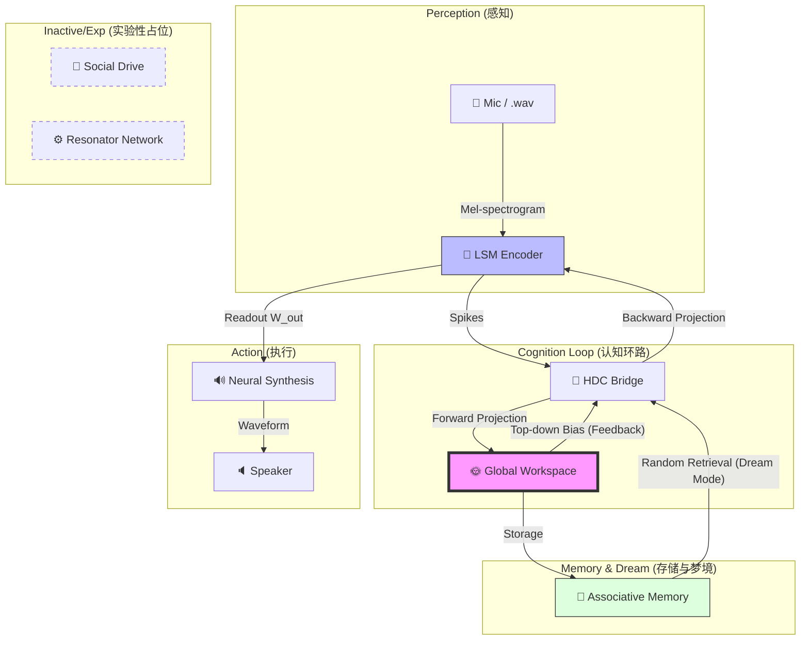

# AION Voice 🔊🤖

[](https://www.python.org/downloads/)
[](https://pytorch.org/)
[](https://opensource.org/licenses/MIT)

> "让液态流动神经元与全局意识在实时交互中碰撞。" —— **AION Voice** 是一个实验性的、模块化的语音感知与生成架构。

---

## 🌟 项目愿景

**AION Voice** 旨在探索神经形态工程（Neuromorphic Engineering）与认知科学（Cognitive Science）在音频处理领域的交集。它不仅仅是一个语音合成器，而是一个具备“自发性活动”的认知智能体原型，通过液态机（LSM）实时捕获时间动态，并利用全局工作空间（GWT）实现信息的跨模块广播。

### 核心亮点
- **🌊 时间编码**：利用 Liquid State Machine (LSM) 的高维、非线性动力学特性捕捉音频信号的瞬态。
- **🧠 联想记忆**：集成 Modern Hopfield Network (MHN) 实现大容量、快速的记忆存储与检索。
- **🌞 全局广播**：基于 Global Workspace Theory (GWT) 的注意力机制，协调多模块间的神经信息交换。
- **🌙 梦境生成**：当环境安静时，智能体进入“梦境模式”，通过自研的读取器回放并重构记忆碎片。

---

## 🏗️ 认知架构 (Architecture)

AION Voice 的核心是一个基于反馈的实时认知环路。该图描述了当前版本（v1.0）代码中实际执行的数据流向。



---

## 🧩 模块深度解析 (Module Deep Dive)

### 1. `src/lsm.py` (Liquid State Machine)
**核心原理**：作为储层计算（Reservoir Computing）的一种，LSM 利用 LIF 神经元捕捉音频的时间动态。脉冲发放模式被视为音频特征的瞬时“指纹”。

### 2. `src/adapter.py` (HDC Bridge)
**关键发现**：它是系统的枢纽。`forward` 将离散脉冲投影到 1024 维 HDC 空间进行逻辑广播；`backward` 将 HDC 概念反向投影回神经元电流，实现自顶向下的感知引导。

### 3. `src/gwt.py` (Global Workspace)
**逻辑实现**：目前通过软注意力机制维持一个“工作空间”向量，并将信息广播给记忆模块。它是感知环路与长期记忆之间的缓冲层。

### 4. `src/mhn.py` (Modern Hopfield Network)
**存储机制**：负责“先天记忆”的预载与实时语音模式的存储。在“梦境模式”下，它绕过实时输入，直接驱动感知环路产生合成声音。

### 5. 实验性模块 (Inactive)
- `src/drive.py` & `src/hrr.py`：代码中已初始化但尚未完全集成进主循环，预留用于未来的需求驱动与语义分解。

---

## 🚀 快速上手 (Quickstart)

### 1. 环境准备
确保系统已安装 `portaudio` (音频 IO 基础库)。

**macOS**:
```bash
brew install portaudio
```

**Ubuntu**:
```bash
sudo apt-get install libportaudio2
```

### 2. 安装 Python 依赖
建议使用 Python 3.9+ 环境。

```bash
pip install -r requirements.txt
```

### 3. 启动交互式智能体
运行主循环，确保麦克风已连接。

```bash
# 启动实时交互（包含梦境回放功能）
python scripts/interaction_loop.py
```

> [!TIP]
> **Dashboard 监控**: 如果你想实时观察 LSM 的脉冲发放模式，请在运行前启动 Visdom 浏览器服务器：`visdom`。

---

## 🔄 认知生命周期 (Life Cycle)

1.  **倾听 (Listen)**：实时捕捉 512 维的 Mel 频谱特征。
2.  **触发 (Fire)**：LSM 内 2000 个神经元产生复杂的脉冲震荡。
3.  **内省 (Think)**：HDC 转换后的概念进入全局工作空间，并尝试从记忆库中寻找共鸣。
4.  **记忆 (Learn)**：如果听到新颖且响亮的声音，MHN 会自动将其存入联想矩阵。
5.  **梦境 (Dream)**：静默 5 秒后，系统开始随机触发记忆节点的自顶向下（Top-down）偏置，生成类似“白日梦”的回放声音。

---

## ✉️ 联系与归属

- **作者**: lkcfqy
- **技术支持**: Antigravity AI
- **仓库地址**: [lkcfqy/AION_voice](https://github.com/lkcfqy/AION_voice)

---

## 📄 开源协议
本项目采用 [MIT License](LICENSE) 授权。

